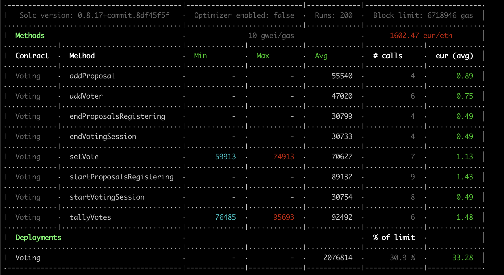

# Voting - Tests

## Run tests :

run a local ganache on port 7545 and network

```json
{
	"networks": {
	    "development": {
	      "host": "127.0.0.1", 
	      "port": 7545,
	      "network_id": "5777"
	    }
	}
}
```

then run :
```console
truffle test test/Voting.js --network development
```


## Gas Reporting



# Tests coverage :

## Access Security tests

- All functions accessible only by the owner should revert when accessed by someone else
- All functions accessible only by a voter should revert when accessed by anyone not voter

## When Voting Status is RegisteringVoters

- Test all forbidden status changes
- Owner can add a voter
- Owner can add same voter twice
- Voters cannot add proposal yet
- Status can be moved to ProposalsRegistrationStarted

## When Voting Status is ProposalsRegistrationStarted

- Test all forbidden status changes
- Owner cannot add voter anymore
- Voter cannot add an empty proposal
- Voter can add a proposal
- Voter can read a proposal
- Voter cannot vote yet
- Status can be moved to ProposalsRegistrationEnded
- *(now, voter cannot add a proposal anymore)*
- Status can be moved to VotingSessionStarted

## When Voting Status is VotingSessionStarted

- Test all forbidden status changes
- Voter cannot vote for a proposal id that doesnt exists
- Voter can vote for a proposal
- Voter cannot vote twice
- Voter should have his votedProposalId saved
- First proposal should have one vote
- First proposal should have 2 votes when voted by an another voter
- Status can be moved to VotingSessionEnded
- *(now, voter cannot vote anymore)*
- Owner can tally votes and status should be VotesTallied
- Owner cannot tally votes again

## When Voting has ended

### proposal 1 should be the winner

- winningProposalID should be 1


### no one has voted

- winningProposalID should be 0


### equality

- winningProposalID should **not** be 0


